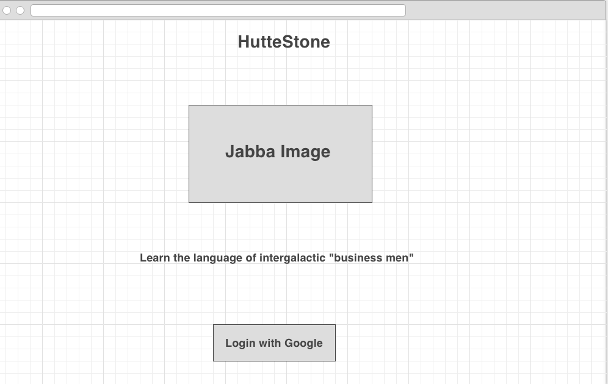
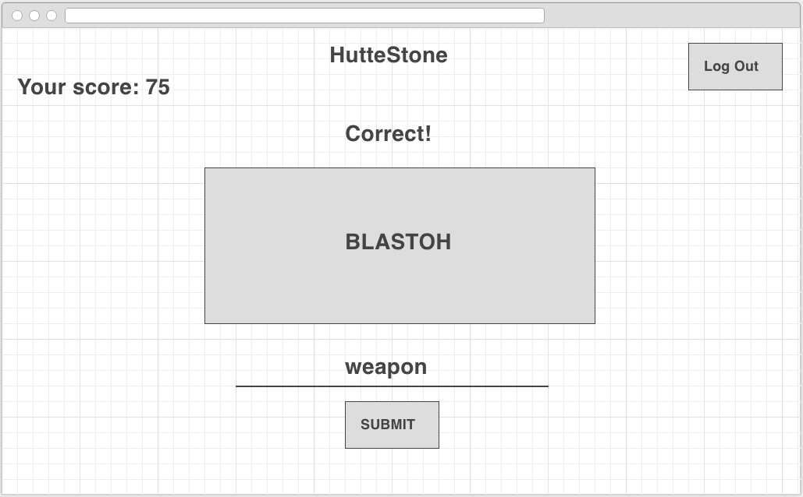

# Week 11 Project - [Thinkful](https://www.thinkful.com/) Full Time Bootcamp

## Installation

1. Clone the repo using `git clone https://github.com/LifelongLearner13/huttese_stone_spaced_repetition.git`
2. `cd` to the `huttese_stone_spaced_repetition`

## Project

You have been hired by language learning startup FrenchX to create an app which uses [spaced repetition](https://en.wikipedia.org/wiki/Spaced_repetition) to help people memorize a foreign language. The app will display words in one language, and ask you to recall the corresponding word in a second language. You will need to develop an algorithm which determines which words to test the user on, create a frontend which displays the words and allows the user to enter answers, and a backend to store the user's progress so they can pick up and continue learning at any point.

## Requirements

- [x] Technologies: Node.js, Express, MongoDB, Passport, OAuth
- [] Allow users to register/login using Google OAuth
- [x] Use the spaced repetition algorithm to generate the next word pair
- [x] Pairs of words should be stored in a Mongo database

  - This should be a fixed array of questions for an MVP

- [x] Store the number of questions which users have answered correctly in the database

- [x] Store whatever information is needed for the algorithm about the user's answer history in the database

[Full Project Specifications](https://gist.github.com/oampo/c5c93a27970908aee41315897438fe14)

## Wireframes

### Landing Page

### Quiz

